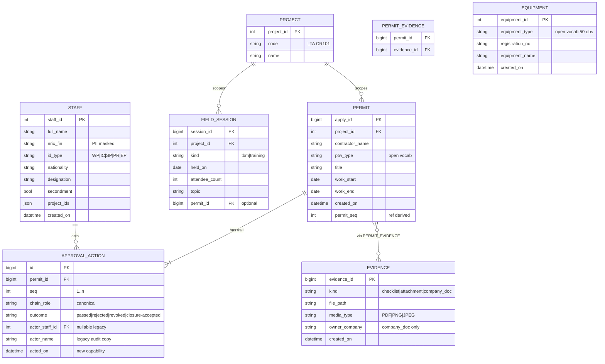

# Consolidated model — YAGNI/SOLID optimization

The **authoritative optimized view**, distilled from `user-stories.md`,
`use-case-activity.md`, and `data-model.md` via a discovery + requirements
review against measured archive data. Supersedes those docs for greenfield
decisions; they remain as BES-behavior reference.

Net effect: **28 stories → 9 · 16 entities → 8 · 4 dead schema fields dropped**.

## 1. Verified corrections (docs vs measured data)

| Claim in earlier docs | Measured reality |
|-----------------------|------------------|
| 13 equipment types | **50 distinct** — open vocabulary, never closed enums |
| 6-step workflow, 6-role enum | Chains are **1–7 steps**; 25 permits have a 7th `Closure Accept` step |
| PTW status enum (6 values) | **11 observed**, incl. `Rejected(Inspector)`, `Inspector` — a role absent from every trail |
| CHK dedup 5.3:1 | CHK **1.54:1** (6,541→4,255); ATT **58:1** (16,246→278) — attachments are a shared library |
| `MONTHLY_STAT` derivable from daily | **Partially**: month windows double-count boundary days (PTW counter proves it); Participants not recomputable → keep legacy as frozen snapshot |
| Monthreports 2018→2026 | **43 files (2018-01→2021-07) are empty templates**; real data starts 2021-08, exactly where `statistics.jsonl` begins |
| COMPANY entity | **No company data in archive** — `company.jsonl` is the document register; company exists only as a string on permits |
| Constants | `staff.status`=Normal ×4207; `equipment.status`=Available ×2475; `doc.favorite` empty ×103; `doc.label`="Others" ×103 |

## 2. Consolidated stories (CS) — 9 total

| ID | From | Story | Acceptance essentials | Entities |
|----|------|-------|----------------------|----------|
| CS-01 | US-01, 06 | Submit a PTW, get printable permit | type/desc/contractor/dates → immutable id + human ref; PDF renders on demand; step-1 trail entry | PERMIT, PROJECT |
| CS-02 | US-02, 03, 04, 05, 08 | **Configurable** approval chain + audit trail | chain from template (default 2×Assess, Ack, Approve, closure); every action appends immutable (actor, role, outcome, **timestamp**); status = derived from trail tail; reject/revoke terminal at any gate | PERMIT, APPROVAL_ACTION |
| CS-03 | US-09–12 | File & retrieve **evidence** (checklists, docs) against permits | binary + kind, N:M to permits (58:1 sharing is real); content-id dedup; one action = all evidence for a permit; inspection = checklist filing | EVIDENCE, PERMIT_EVIDENCE |
| CS-04 | US-13, 14 | Staff register + project membership | CRUD (name, badge, NRIC/FIN, id_type, nationality, designation, secondment); PII masked; membership visible | STAFF |
| CS-05 | US-15, 16 | Equipment + company-doc registers | equipment CRUD (open-vocab type); company docs = EVIDENCE kind=document | EQUIPMENT, EVIDENCE |
| CS-06 | US-17, 18 | Record TBM/training sessions with headcount | kind(tbm\|training), date, headcount, optional topic/permit link; feeds counters | FIELD_SESSION |
| CS-07 | US-21, 22, 24 | Counters by any window/company/day from **one derived source** | computed from base records (no stats tables); CSV/xlsx export replaces broken BES export; BES history = read-only snapshot | views + LEGACY_STAT_SNAPSHOT |
| CS-08 | US-23 | Monthly safety report (xlsx) | one generator fed by CS-07; pre-2021-08 renders empty (it *is* empty) | derived |
| CS-09 | US-25–28 | Unattended full + incremental migration via JSONL contract | resumable, exit-code semantics; stories depend only on `schemas/*.schema.json`, never BES endpoints | all |

## 3. Cut list (YAGNI)

| Cut | Rationale |
|-----|-----------|
| US-07 QR stickers | render variant of CS-01 PDF; zero evidence anyone prints them |
| US-19 face-rec attendance | BES export dead 8 yrs (`atd_program_attend_YYYYMM` never created); biometric load for no data |
| US-20 incidents | counter **0 across all 67 windows**; build on first real incident |
| US-24 register export | broken by construction in BES; folded into CS-07 |
| US-09 separate story | no web record data — only its checklist PDF; folds into CS-03 |
| COMPANY entity | no data exists; string on PERMIT (normalize in v2 if needed) |
| MONTHLY_STAT / DAILY_COMPANY_STAT | derived (and provably drifted in BES); daily never even captured |
| TBM_ATTENDANCE, TRAINING_SESSION, INCIDENT entities | headcount-only v1 (CS-06); training = FIELD_SESSION.kind |
| Epic-6 as 4 stories | one pipeline, one contract, one run-mode |

## 4. Optimized ERD — 8 entities

**Dropped vs old ERD:** PROGRAM (constant→config), COMPANY (no data),
WORKFLOW_STEP (→ APPROVAL_ACTION w/ outcome+ts), CHECKLIST_REPORT + ATTACHMENT
+ COMPANY_DOC (→ EVIDENCE + kind), MONTHLY_STAT + DAILY_COMPANY_STAT (→ views
+ frozen LEGACY_STAT_SNAPSHOT), INCIDENT (deferred).
**Dropped fields:** all 4 constant/empty fields, `staff.sn`, `staff.status`,
`equipment.status/where_project`, `badge_no` (derived from name residue).

**Story × entity matrix:** CS-01→PERMIT · CS-02→APPROVAL_ACTION · CS-03→EVIDENCE
· CS-04→STAFF · CS-05→EQUIPMENT · CS-06→FIELD_SESSION · CS-07/08→views ·
CS-09→contract.

## 5. SOLID refactors (each saves code surface)

| Principle | Change | Saves |
|-----------|--------|-------|
| SRP | status OFF the permit; derived from trail tail | per-role status branches in every handler; enum migration (11 obs vs 6 modeled) |
| OCP | approval chain as template config, not enum | workflow switch-statements; per-program special-casing |
| OCP | open vocabularies (equipment 50, ptw types 16) | enum-migration PRs forever |
| LSP/ISP | one `CounterSource(window, groupBy)`; xlsx + drilldown substitute it | two stats tables + sync job (BES couldn't keep them consistent) |
| ISP | one EVIDENCE entity w/ kind | 3 repos/upload/download services → 1; one dedup path (58:1 sharing) |
| DIP | stories depend on JSONL contract only; BES endpoints only in CS-09 | endpoint-shaped coupling (what leaked US-24 into stories) |
| SRP | ingest canonicalizes trail roles (19 dirty values) w/ `raw_role` kept | every consumer defending dirty roles |

## 6. Schema deltas (`schemas/*.schema.json`)

- `ptw-record`: keep 12-value status but annotate *derived*; `serial_no` derived; add optional `raw_role` + absent `acted_on`
- `staff-record`: **drop `sn`**; `badge_no` optional/derived; `status` nullable
- `equipment-record`: **drop `status`**; type description "50 observed"
- `company-document`: **drop `favorite`, `label`**; `document_id` tightened `^[0-9]+$`
- legacy `statistics.jsonl` (67 windows): import as-is, no new schema

## 7. Open questions (product owner)

1. Single-project forever? (swings US-14 cut + `where_project`)
2. Does anyone print/scan QR stickers in the field?
3. Is the monthly xlsx layout contractual (reproduce cell-for-cell)? Where do accidents/mandays inputs come from?
4. Is attendance fraud-resistance a requirement or a BES fossil?
5. What must the trail capture that BES never did (timestamps, rejection reasons)?

## Status note

`company_daily.jsonl` **captured**: 20,659 unique (date × company) rows,
2021-08-13 → 2026-08-16, 51 companies (matches the server's own window
totals once the paginator's duplicate re-serves are deduped — all duplicates
were byte-identical; scraper now dedupes + loop-guards). Post-2021 daily
history is therefore real data; pre-2021 remains empty on the server.
