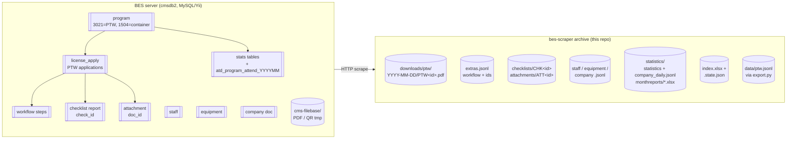
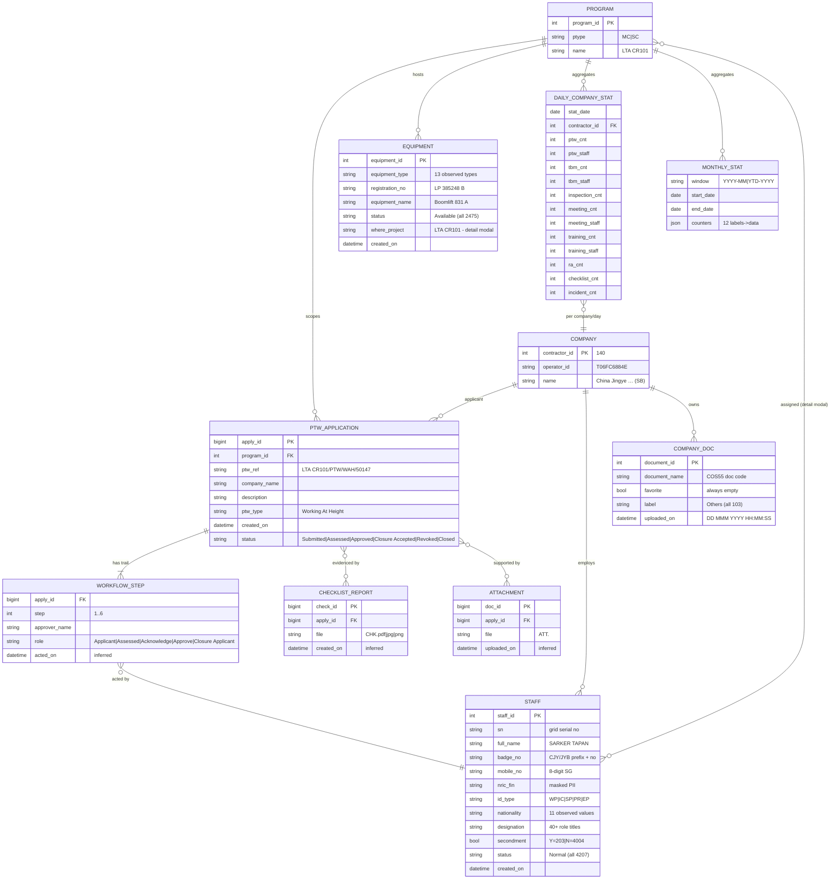
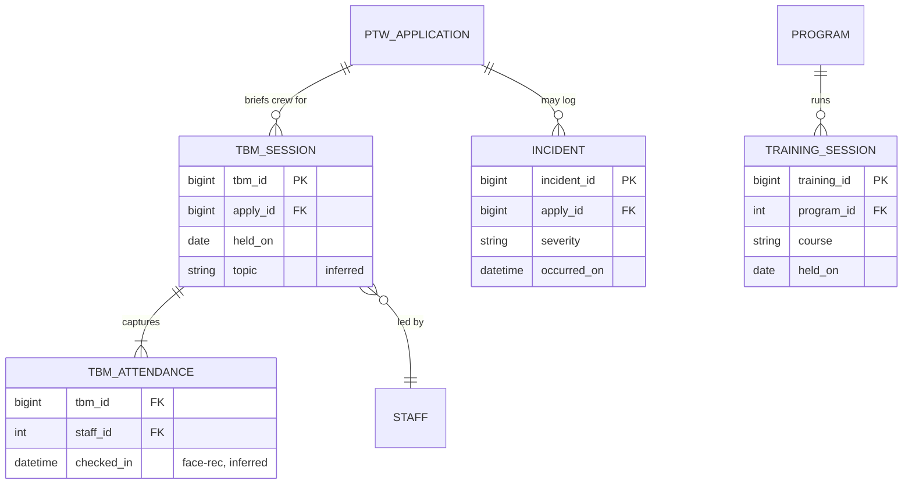

# Data model — how BES saves data & inferred ERD

> **Optimized ERD:** see [`consolidated-model.md`](consolidated-model.md) — 16→8 entities after YAGNI/SOLID review against measured data.

Reverse-engineered from scraped payloads, grid columns, SQL error messages
(`cmsdb2.export_task`, `cmsdb2.atd_program_attend_YYYYMM`) and JSON shapes in
`downloads/`. **Inferred** = property list is our best model of the server
schema; verify against `schemas/*.schema.json` for the migration contract.

## 1. Storage model — server side (inferred) vs our archive (actual)



Key storage facts observed:

| Fact | Evidence |
|------|----------|
| Files live outside the DB under `cms-filebase/` | QR export returned `/cms-filebase/filebase/tmp/<id>.pdf` |
| Attendance is archived into **monthly tables** `atd_program_attend_YYYYMM` | exportepss CDbException |
| Async exports queue into `export_task(file_size, module, sub_module, status, record_time, program_id)` | upload/export CDbException |
| Checklist binaries are typed server-side (PDF/IMG magic bytes) | `downloadpdf&check_id` returns mixed `%PDF`/`%PNG`/`%JPEG` |
| Dedup: 22,787 refs → 4,255 unique CHK + 278 unique ATT | same id referenced by many PTWs |
| Stats drill-down materialised per company/day | `dateappgrid` rows keyed `(date, company)` |

## 2. Inferred ERD



### Mobile-only (counters exist, records not web-exposed)



### Notes

- `WORKFLOW_STEP.acted_by → STAFF` is joined on name only (trail shows
  `approver_name`); a production model should key on `staff_id`.
- `CHECKLIST_REPORT`/`ATTACHMENT` are many-to-many in practice (one file
  referenced by several PTWs — observed dedup ratio 5.3:1 for CHK).
- `DAILY_COMPANY_STAT` composite key = `(stat_date, contractor_id)`.
- Our archive adds no new entities — every JSONL maps 1:1 onto this ERD.

## Re-render SVGs

```bash
for f in docs/diagrams/data-*.mmd; do
  npx -y @mermaid-js/mermaid-cli -i "$f" -o "${f%.mmd}.svg" -b white
done
```
