# Use case & activity diagrams — per user story

Companion to [`user-stories.md`](user-stories.md). Mermaid approximates UML:
**use case diagrams** = flowchart with actors (`[box]`) → use cases (`((ellipse))`);
**activity diagrams** = flowchart TD with start/end stadiums, decisions `{}`,
actions in rectangles.

Story → diagram map:

| Stories | Use case diagram | Activity diagram |
|---------|------------------|------------------|
| US-01…05, 08 | [UC-1 PTW lifecycle](#uc-1--ptw-lifecycle) | [AC-1 PTW workflow](#ac-1--ptw-approval-activity) |
| US-06, 07 | [UC-1 PTW lifecycle](#uc-1--ptw-lifecycle) | [AC-1 PTW workflow](#ac-1--ptw-approval-activity) |
| US-09…12 | [UC-2 Checklists & attachments](#uc-2--checklists--attachments) | [AC-2 Checklist/attachment flow](#ac-2--checklist--attachment-activity) |
| US-13…16 | [UC-3 Registers](#uc-3--registers) | [AC-3 Register maintenance](#ac-3--register-maintenance-activity) |
| US-17…20 | [UC-4 Field activities](#uc-4--field-activities) | [AC-4 TBM session](#ac-4--toolbox-meeting-activity) |
| US-21…24 | [UC-5 Statistics & reporting](#uc-5--statistics--reporting) | [AC-5 Report generation](#ac-5--statistics-report-activity) |
| US-25…28 | [UC-6 Migration](#uc-6--migration-tooling) | [AC-6 Scrape run](#ac-6--scraper-run-activity) |

---

## UC-1 — PTW lifecycle

Covers US-01, US-02, US-03, US-04, US-05, US-06, US-07, US-08.

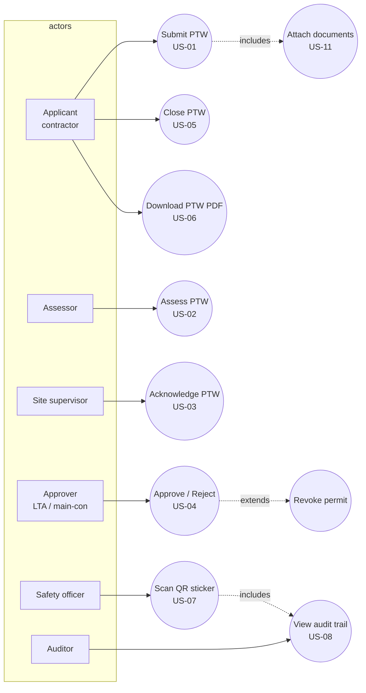

## AC-1 — PTW approval activity

State-accurate to the scraped workflow trails (6 steps, `Revoked` branch).

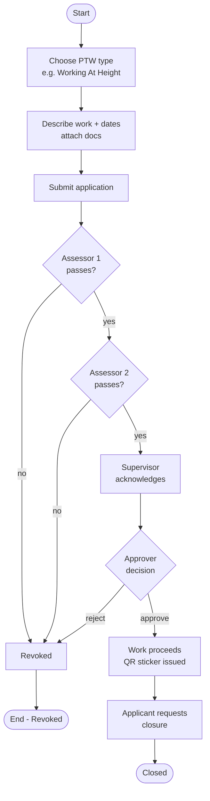

---

## UC-2 — Checklists & attachments

Covers US-09, US-10, US-11, US-12.

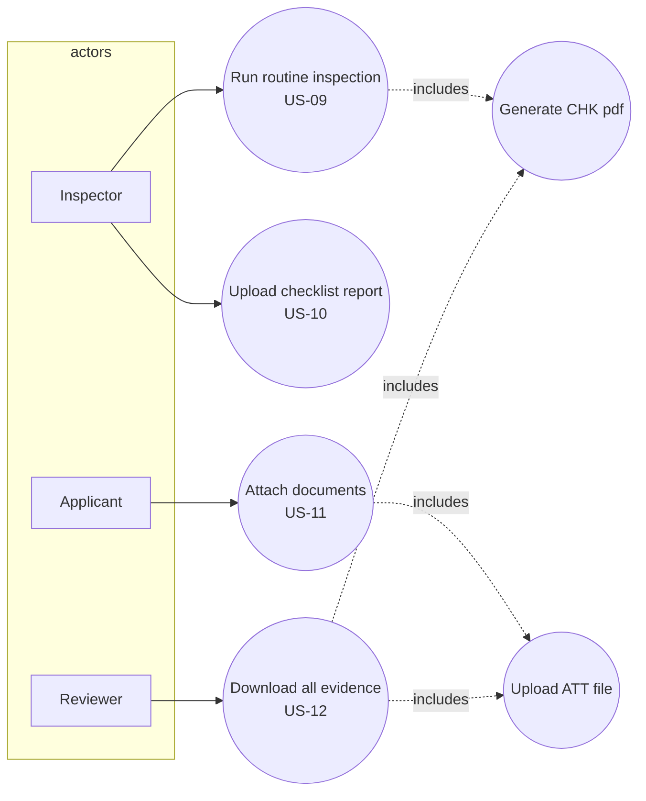

## AC-2 — Checklist / attachment activity

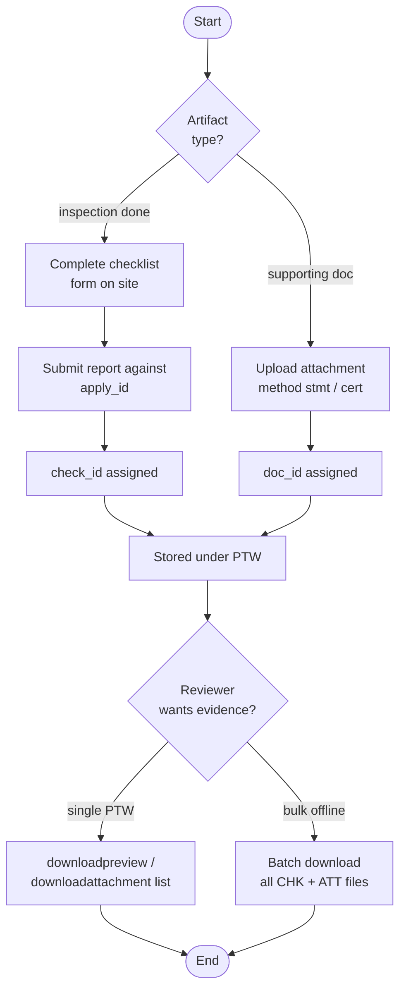

---

## UC-3 — Registers

Covers US-13, US-14, US-15, US-16.

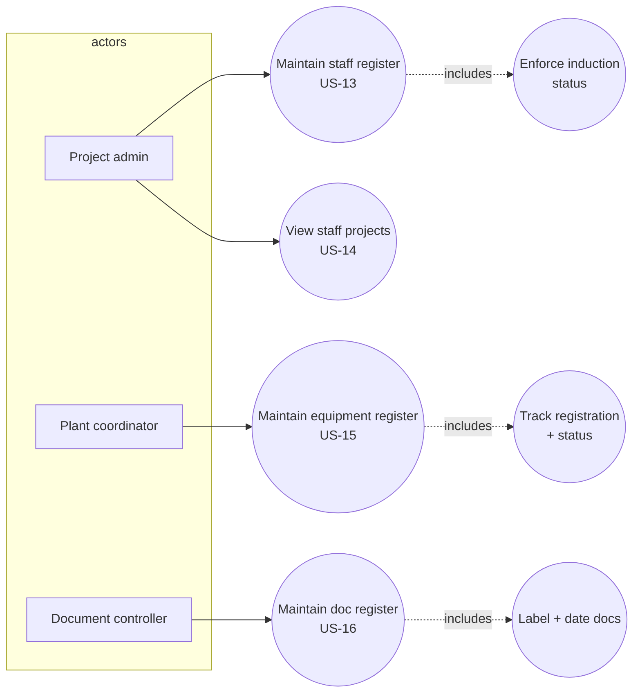

## AC-3 — Register maintenance activity

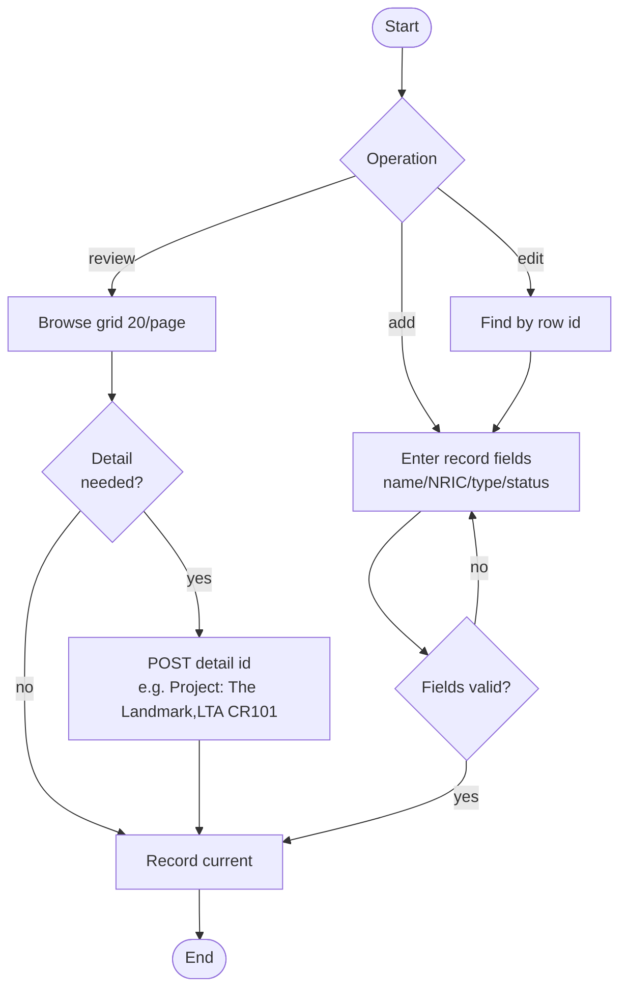

---

## UC-4 — Field activities

Covers US-17, US-18, US-19, US-20. (TBM/training are mobile-app in BES — web exposes only counters.)

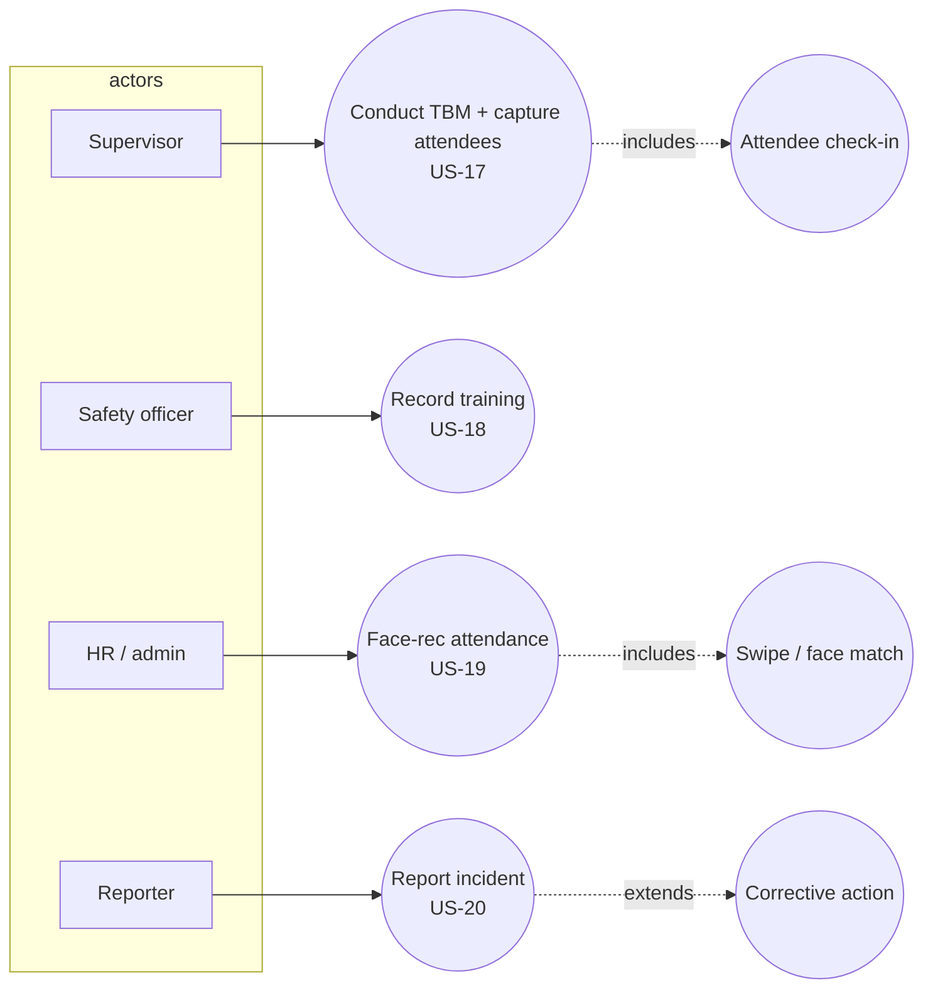

## AC-4 — Toolbox meeting activity

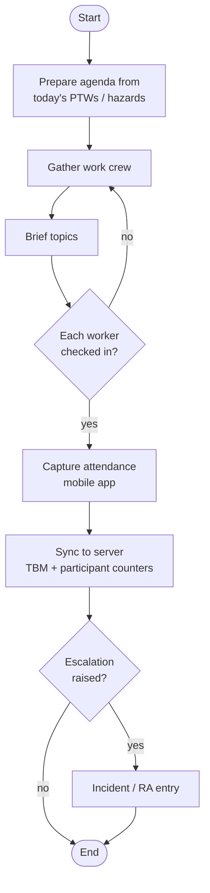

---

## UC-5 — Statistics & reporting

Covers US-21, US-22, US-23, US-24.

```mermaid
flowchart LR
    subgraph actors
        SM[Safety manager]
        MG[Manager]
    end
    SM --> UC1((View monthly counters<br/>US-21))
    SM --> UC2((Drill down by company/day<br/>US-22))
    MG --> UC3((Export monthly xlsx<br/>US-23))
    MG --> UC4((Export PTW register<br/>US-24 - broken))
    UC1 -.includes.-> UC5((moduledaycnt window)]
```

## AC-5 — Statistics report activity

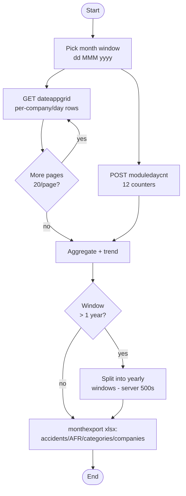

---

## UC-6 — Migration tooling

Covers US-25, US-26, US-27, US-28.

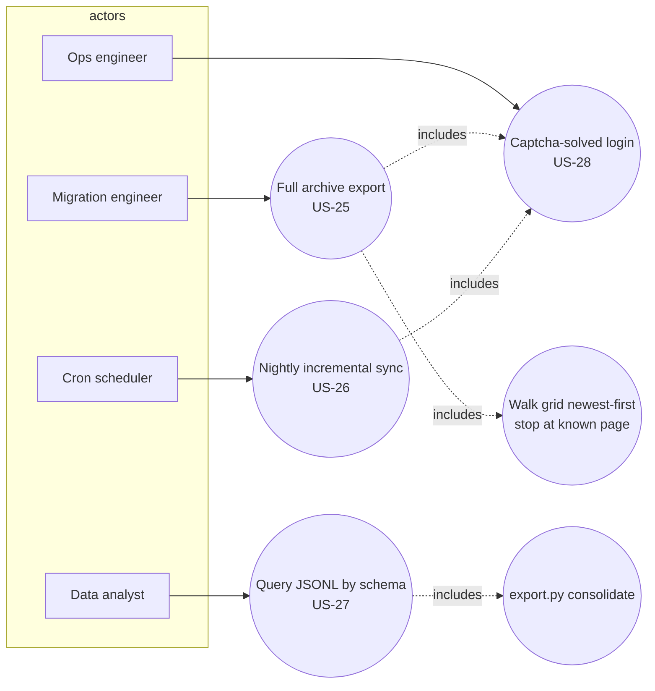

## AC-6 — Scraper run activity

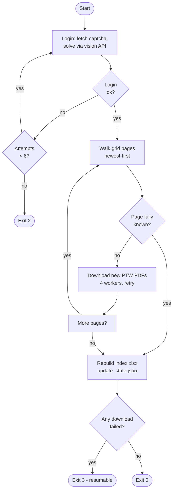

---

## Re-render SVGs

```bash
for f in docs/diagrams/uc-*.mmd docs/diagrams/ac-*.mmd; do
  npx -y @mermaid-js/mermaid-cli -i "$f" -o "${f%.mmd}.svg" -b white
done
```
