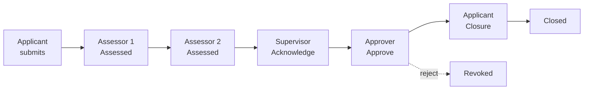
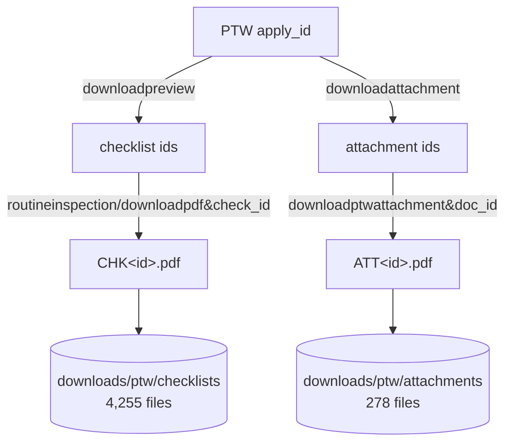
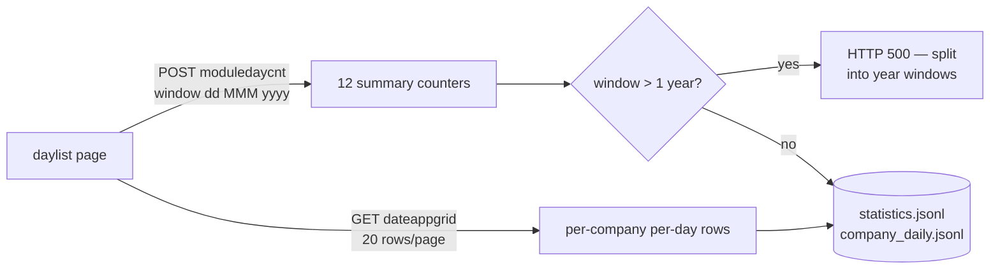
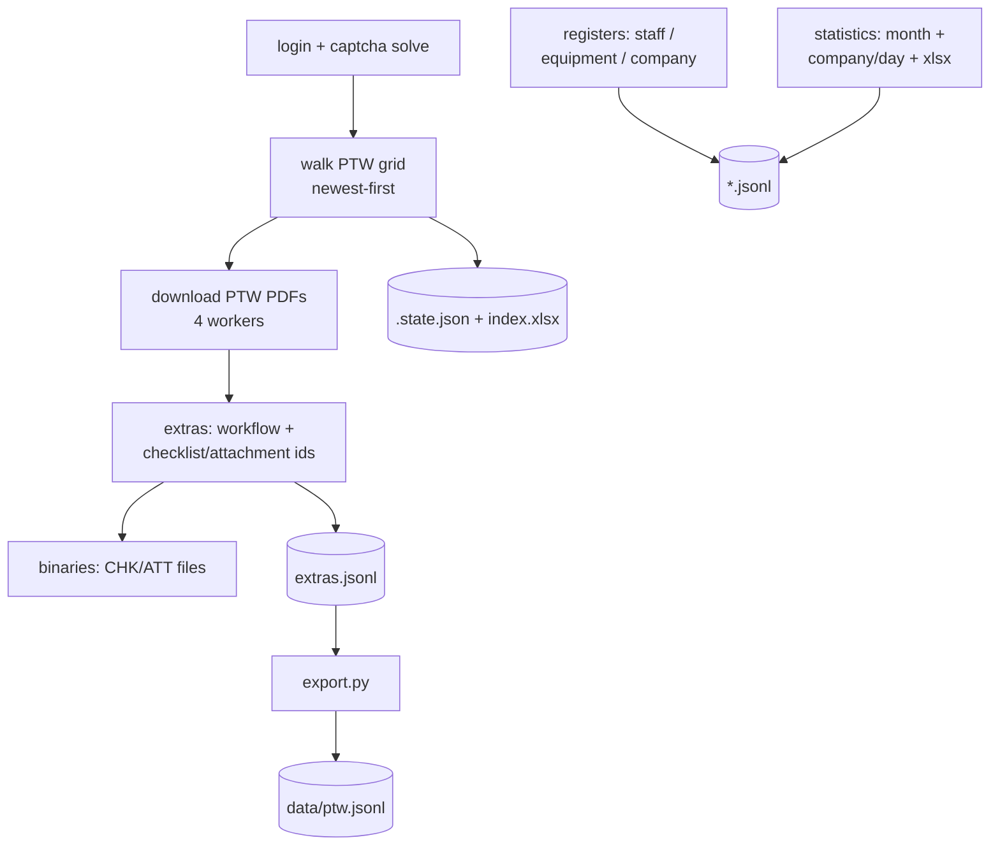

# BES user stories — derived from live features

> **Optimized version:** see [`consolidated-model.md`](consolidated-model.md) — 28→9 stories after YAGNI/SOLID review against measured data.

User stories for a replacement system, reverse-engineered from the BES
(`service.globalbes.sg`) features actually exercised by this scraper suite.
Every story cites the BES endpoint it replaces and a real example from our
scraped data. Base URL for all links:
`https://service.globalbes.sg/ctmgr/index.php`

Diagrams: inline Mermaid (renders on GitHub/VS Code); standalone SVGs live in
[`docs/diagrams/`](diagrams/) with `.mmd` sources preserved.

## Epic 1 — PTW lifecycle

| ID | As a… | I want to… | So that… | BES feature (link) | Example / evidence |
|----|-------|-----------|----------|--------------------|--------------------|
| US-01 | contractor applicant | submit a PTW application (type, description, company, dates) | high-risk work is authorised before it starts | [`license/licensepdf/list`](https://service.globalbes.sg/ctmgr/index.php?r=license/licensepdf/list&program_id=3021) | `LTA CR101/PTW/Working At Height/50147` — ZHONG HE ENGINEERING, "MEWP WORKING HIGHT ADBD LEVEL 3.", 16 Aug 2026 |
| US-02 | assessor | review submitted PTWs and record my assessment | risks are evaluated before approval | workflow `preview` modal | Step 2–3 `Assessed` by `CJY-ID HASAN ENJAMUL`, `AL AMIN` |
| US-03 | site supervisor | acknowledge approved PTWs for my area | I confirm awareness of the work | workflow step 4 | `JYB 1240 SARDAR MD EMON` — `Acknowledge` |
| US-04 | approver (LTA/main-con) | approve or reject assessed PTWs | only safe work proceeds | workflow step 5 | `Reynald Lara Dionillo` — `Approve`; statuses incl. `Revoked` |
| US-05 | applicant | close out my PTW when work ends | permits reflect live site state | closure step 6 | `Closure Applicant` step; `Closure Accepted` status |
| US-06 | any user | download the permit as PDF | a printable legal record exists | [`staffdownload`](https://service.globalbes.sg/ctmgr/index.php?r=license/licensepdf/staffdownload&apply_id=1785719688172&app_id=PTW&tag=1) | 3,129 PTW PDFs in `downloads/ptw/` |
| US-07 | safety officer on site | scan a QR sticker on a permit and open its record | I can verify permits physically at the workfront | [`createqrpdf`](https://service.globalbes.sg/ctmgr/index.php?r=license/licensepdf/createqrpdf) → `downloadqrzip` | ZIP of per-PTW sticker PDFs (LTA CR101 header, title, contractor, QR) |
| US-08 | auditor | view the full approval trail of any PTW | accountability for who approved what and when | [`preview`](https://service.globalbes.sg/ctmgr/index.php?r=license/licensepdf/preview&apply_id=1785719688172&app_id=PTW) | 6-step trail in `extras.jsonl` (15,254 steps scraped) |

### PTW workflow (as scraped from `preview` modals)



## Epic 2 — Checklists & attachments

| ID | As a… | I want to… | So that… | BES feature (link) | Example / evidence |
|----|-------|-----------|----------|--------------------|--------------------|
| US-09 | inspector | run routine inspections against a PTW | hazards are re-checked during the work | [`routineinspection`](https://service.globalbes.sg/ctmgr/index.php?r=routine/routineinspection/grid&page=0&q_order=) backend | 510 inspections Aug 2026 (stats counter) |
| US-10 | inspector | upload completed checklist reports to a PTW | evidence is filed against the permit | [`downloadpreview`](https://service.globalbes.sg/ctmgr/index.php?r=license/licensepdf/downloadpreview&apply_id=1785719688172&app_id=PTW) list | 6,541 checklist refs → 4,255 unique PDFs in `downloads/ptw/checklists/` |
| US-11 | applicant | attach supporting documents (method statements, certs) | reviewers have full context | [`downloadattachment`](https://service.globalbes.sg/ctmgr/index.php?r=license/licensepdf/downloadattachment&apply_id=1785719688172&app_id=PTW) | 16,246 attachment refs → 278 unique files (heavy sharing) |
| US-12 | reviewer | download all checklists/attachments of a PTW in one action | reviewing a permit offline is possible | (no BES equivalent — batch exists only in our tooling) | `scrape_ptw_binaries.py` downloaded all 22,787 in 40 min |

### Checklist / attachment data flow (as our scraper sees it)



## Epic 3 — Registers

| ID | As a… | I want to… | So that… | BES feature (link) | Example / evidence |
|----|-------|-----------|----------|--------------------|--------------------|
| US-13 | project admin | maintain a staff register (name, badge, NRIC/FIN, ID type, nationality, designation, secondment, status) | only inducted workers are on site | [`comp/staff/list`](https://service.globalbes.sg/ctmgr/index.php?r=comp/staff/list) | 4,207 records in `staff.jsonl` |
| US-14 | project admin | view which projects a staff member belongs to | cross-project workers are visible | [`comp/staff/detail`](https://service.globalbes.sg/ctmgr/index.php?r=comp/staff/detail) POST `{id}` | detail = `Project: The Landmark,LTA CR101` |
| US-15 | plant coordinator | maintain an equipment register (type, registration no., status) | only inspected equipment is used | [`device/equipment/list`](https://service.globalbes.sg/ctmgr/index.php?r=device/equipment/list) | 2,475 records in `equipment.jsonl` |
| US-16 | document controller | maintain a company document register (name, label, uploaded-on) | document currency is tracked | [`document/company/list`](https://service.globalbes.sg/ctmgr/index.php?r=document/company/list) | 103 records in `company.jsonl` |

## Epic 4 — Field activities (TBM & attendance)

| ID | As a… | I want to… | So that… | BES feature (link) | Example / evidence |
|----|-------|-----------|----------|--------------------|--------------------|
| US-17 | supervisor | conduct a toolbox meeting and capture attendees | every worker is briefed before shift | mobile app only (no web route — verified) | 767 TBM / 18,053 participants in Aug 2026 |
| US-18 | safety officer | record training sessions and attendees | competency is evidenced | mobile counters (`Training 3 / 114`) | training counter, Aug 2026 |
| US-19 | HR/admin | record worker attendance by face recognition | attendance is fraud-resistant | [`attend/*`](https://service.globalbes.sg/ctmgr/index.php?r=attend/record) module | `atd_program_attend_*` tables (export broken server-side) |
| US-20 | reporter | report incidents | incidents drive corrective action | incident counter (0 to date) | stats counter, always 0 in scraped windows |

## Epic 5 — Statistics & reporting

| ID | As a… | I want to… | So that… | BES feature (link) | Example / evidence |
|----|-------|-----------|----------|--------------------|--------------------|
| US-21 | safety manager | see monthly counters for PTW/TBM/inspection/checklist/training/RA/incident | trends are visible at a glance | [`statistics/module/daylist`](https://service.globalbes.sg/ctmgr/index.php?r=statistics/module/daylist) → `moduledaycnt` | Aug 1–16 2026: PTW 3,325 / 24,606 staff; Checklist 5,727 |
| US-22 | safety manager | drill counters down by company and day | hotspots get attention | [`dateappgrid`](https://service.globalbes.sg/ctmgr/index.php?r=statistics/module/dateappgrid&page=0&q%5Bprogram_id%5D=3021&q%5Bstart_date%5D=01+Aug+2026&q%5Bend_date%5D=16+Aug+2026&contractor_id=&operator_id=&operator_name=&q_order=) | 20 rows/page; `company_daily.jsonl` |
| US-23 | manager | export a monthly safety report (accidents, AFR, unsafe categories, company contributions) | statutory/contractual reporting is one click | [`monthreport`](https://service.globalbes.sg/ctmgr/index.php?r=license/licensepdf/monthreport) → `license/upload/monthexport` | 104 `.xlsx` (2018-01→2026-08) in `downloads/monthreports/` |
| US-24 | manager | export PTW register to Excel (async) | offline analysis | `license/upload/export` — **broken**: queues a task, no download route | returns `{"status":"1"}`, file never retrievable |

### Statistics drill-down flow



## Epic 6 — Migration & offboarding (our scrapers as the story)

| ID | As a… | I want to… | So that… | Tooling | Example / evidence |
|----|-------|-----------|----------|---------|--------------------|
| US-25 | migration engineer | export the full PTW archive (PDF + metadata + trails) | history survives the BES shutdown | `ptw_scraper.py`, `scrape_ptw_extras.py` | 3,129 PTWs, 15,254 workflow steps |
| US-26 | migration engineer | nightly incremental sync of new PTWs | the archive stays current until cutover | `ptw_scraper.py` cron | `downloads/ptw/.state.json` walk state |
| US-27 | data analyst | query everything as structured JSONL conforming to schemas | the new system can bulk-import | `schemas/*.schema.json`, `export.py` | `data/ptw.jsonl` |
| US-28 | ops engineer | captcha-solved unattended login | scheduled runs need no human | `ptw_scraper.http_login()` | Z.AI `glm-5v-turbo` vision solve, 6 retries |

### Migration pipeline (this repo)



## Rendering the SVGs

```bash
for f in docs/diagrams/*.mmd; do
  npx -y @mermaid-js/mermaid-cli -i "$f" -o "${f%.mmd}.svg" -b white
done
```
